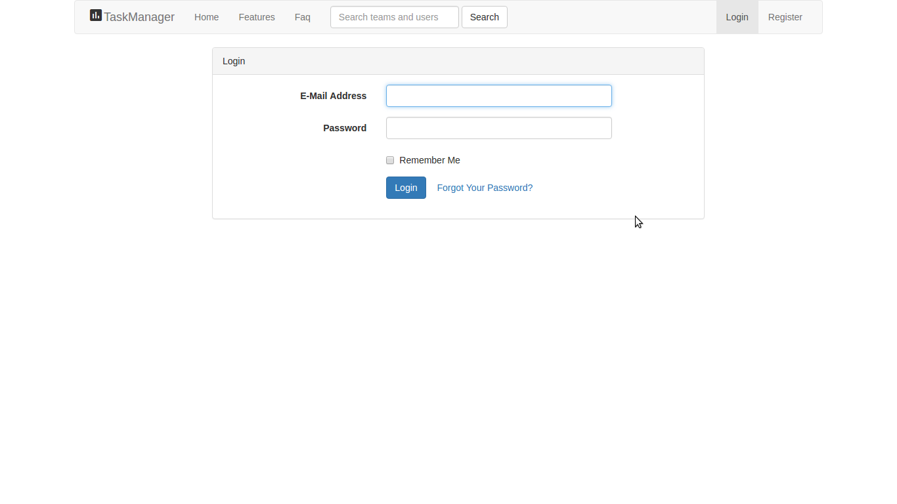

# TaskManager
## Laravel 5.4
### By Juan Morales
###### Little project to get into different aspects of the framework, like validations, requests, middlewares, etc.

Project status and what you can do to improve it

 - [x] System definition
 - [x] Database queries
 - [x] Validations - Examples
 - [x] Custom Request example
 - [x] DB Facade example
 - [x] Eloquent uses
 - [x] ChartJS Graphic status
 - [] Teams module for public and private tasks
 - [] Modularization of Javascript Code

Screenshots

