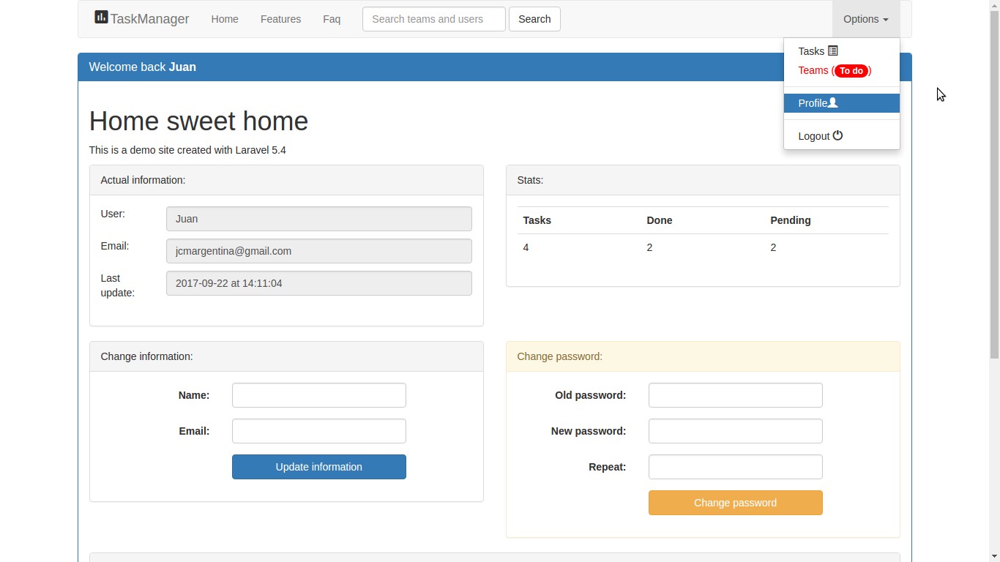
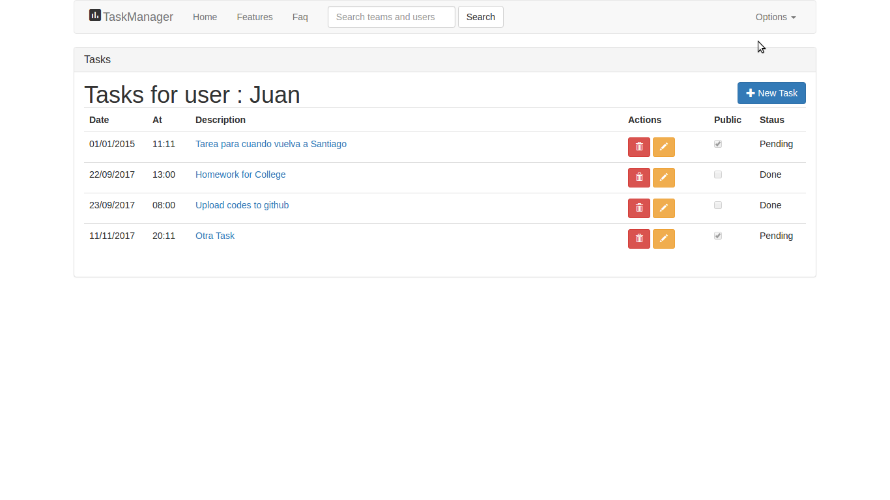
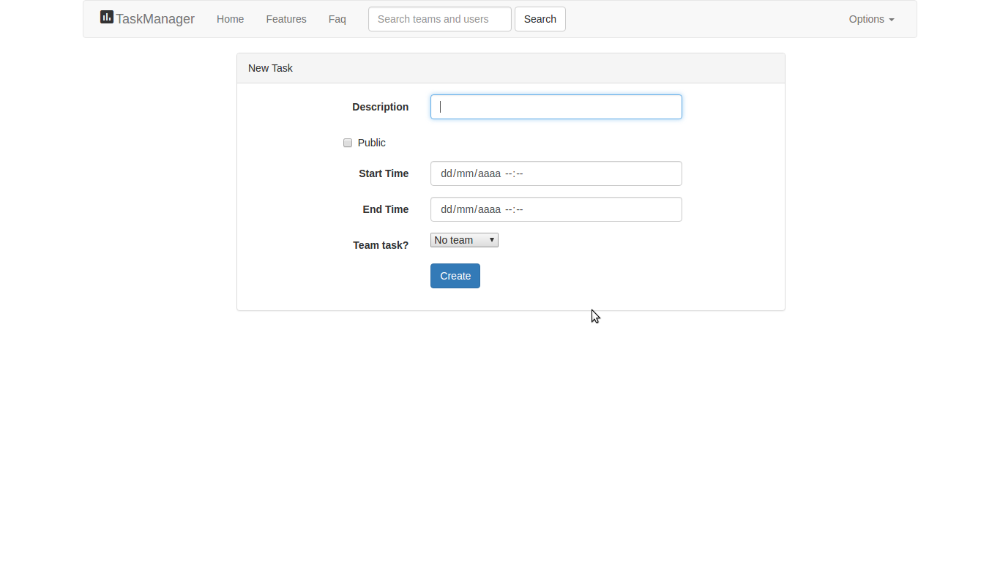
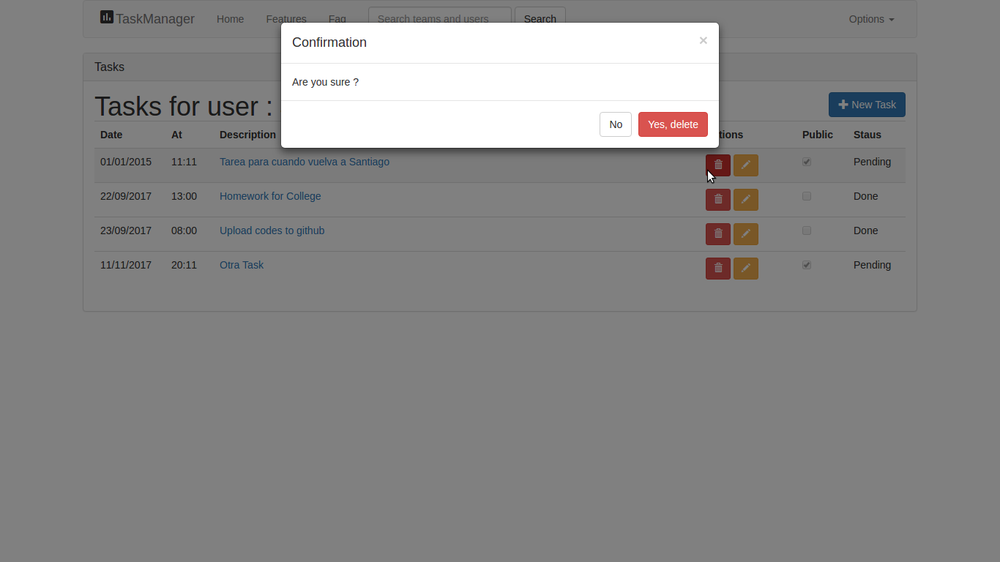

# TaskManager
## Laravel 5.4
### By Juan Morales
###### Little project to get into different aspects of the framework, like validations, requests, middlewares, etc.

Project status and what you can do to improve it

 - [x] System definition
 - [x] Database queries
 - [x] Validations - Examples
 - [x] Custom Request example
 - [x] DB Facade example
 - [x] Eloquent uses
 - [x] ChartJS Graphic status
 - [ ] Teams module for public and private tasks
 - [ ] Modularization of Javascript Code

### How to use it?

1. Download the code
2. The actual code is in the taskmanager folder, so ... get into it
3. Once there have to config the database access through the env file and also in database.php
4. Also, you need to create a database in your DBEngine (MySQL for example) , called taskmanager
5. In a console execute the command: php artisan migrate
6. Finally to lunch the project, execute : php artisan serve

### Screenshots

